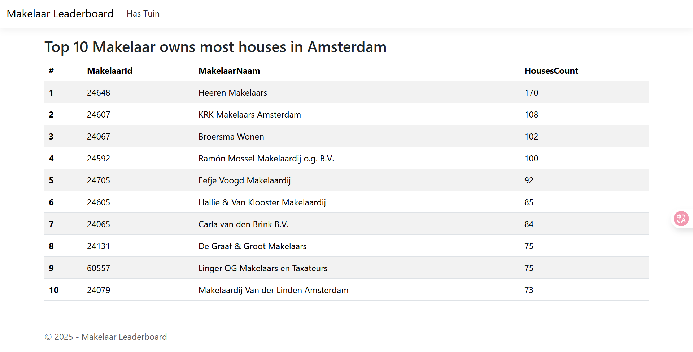
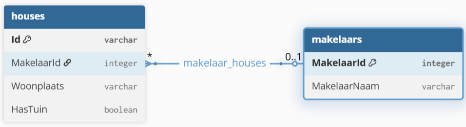
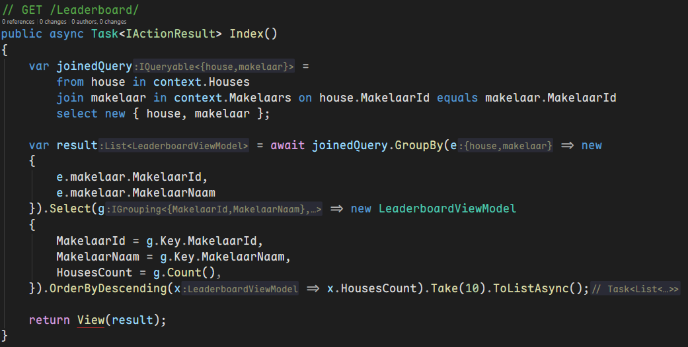
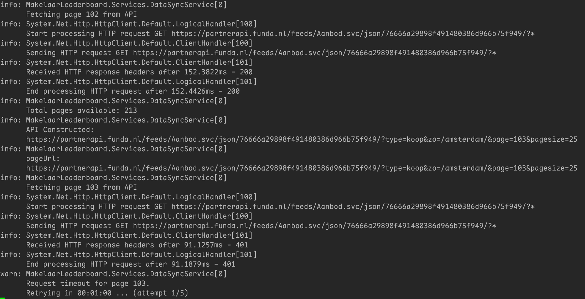

# Makelaar Leaderboard — Funda Take-home Assignment

This repository contains an ASP.NET 10 MVC solution that implements a simple leaderboard for real estate agents (makelaars) based on listing counts retrieved from the Funda API. The app demonstrates data ingestion, storage, query/aggregation with EF Core, and a web UI that displays the top makelaars.

## ✅ What this solution does

- Periodically fetches Funda listing data for Amsterdam and stores it in a local SQLite database
- Provides two leaderboards in simple web UI:
  - Top 10 makelaars by all houses.
  - Top 10 makelaars by houses that include a garden.
- Uses simple await TimeSpan to implement retry policies and rate limiting



## ▶️ Installation & Usage

### Method 1. Access the website directly (recommended)

[https://funda.yanevan.cc/](https://funda.yanevan.cc/)

### Method 2. Build and run locally

1. Clone or download the repository:

```bash
git clone https://github.com/Mano-Liaoyan/funda-assignment.git
```

2. Navigate to the project directory and run the application:

```bash
cd MakelaarLeaderboard
dotnet restore
dotnet build
dotnet run
```

By default, the app runs at `https://localhost:7202` (or your configured ASPNETCORE URLs). Navigate to the root route to see the leaderboard. **Make sure to trust all the certificates if prompted.**

### Method 3. Run with Docker Compose

Inside the project folder, there is a `docker-compose.yml` file that can be used to build and run the application with Docker Compose.

```bash
docker compose up -d
```

## 💡 Approach & Design

### Data model

- `Makelaar` — represents a real estate agent with `MakelaarId`, `MakelaarNaam`, and a collection of `Houses`.
- `House` — represents a listing with `Id`, `MakelaarId`, `Woonplaats` and `HasTuin` (boolean).

The relationship is one-to-many (Makelaar has many Houses). See `MakelaarLeaderboard/Data/MakelaarLeaderboardContext.cs` for EF Core mapping.



### Data ingestion

- The `DataSyncService` runs as a hosted background service and performs the following:

  - Builds Funda API queries for a given city (default `amsterdam`) and optional filters (e.g., `tuin` for houses with garden).

  - Fetches paginated pages of results and deserializes JSON into in-memory objects.

  - Tracks unique makelaars and houses, and updates the database with new/updated rows.

  - Retries API calls on errors with exponential backoff (configurable in code) to handle transient errors.

- The service runs every 1 hour (see `_syncInterval` in `DataSyncService`). On startup the database is created and cleared and an initial sync is performed.

### Querying

- `LeaderboardController` uses LINQ to join `Houses` and `Makelaars`, group by agent and counts houses, then orders the result to show the top 10. Methods are available for the general leaderboard and the `HasTuin` filtered leaderboard.



### Rate Limit Considerations

- The funda API has a constraint of 100 req / 1 minute -> 100 req / 60000 ms -> 1 req / 600 ms
- The maximum pagesize is 25 (it was also interesting that when pagesize > 25, only 25 objects will return and data will be incomplete), we have to do at least 213 requests / minute, which has exceeded the above limitation
- This means our delay should be at least 600ms
- However, since we have a retry mechanism in place, for convenient, I use 100 ms for the fetch delay, and the mechanism will handle rate limit errors if any.
- The service has a retry logic (max retries = 5) for non-200 HTTP responses.
- For each failed request, the delay before the next retry increases exponentially.
- When a retry is successful, the data will be fetched starting from the original page (for instance, if page 103 failed and retried successfully, the next fetch will continue from page 103).
- When the retry attempts exceed the maximum, a warning will be logged, and service will store the data that has been fetched so far to the database.



## ⚙️ Configuration

Configuration resides in `MakelaarLeaderboard/appsettings.json`.

- `ConnectionStrings:MakelaarLeaderboardContext` — path to the SQLite database file (default: `Data Source=MakelaarLeaderboardContext.db`).
- `DataSync:ApiUri` — base URI for the Funda API that the background service will call. This repo includes a sample (partner API with token). Please use a valid Funda API endpoint and token or a local mock for testing.


## 🔬 Database & Migrations

- EF Core migrations are included in `Migrations/`. If you change the model, ensure you add a migration and apply it. You can enter the following commands in the package manager console:
	- Add migration: `Add-Migration NameOfMigration` (from the `MakelaarLeaderboard` project directory).
	- Apply migration: `Update-Database`

## 🧪 Testing & Validation

- Manual testing: start app and visit these routes:
	- `/Leaderboard/` — top 10 overall makelaars
	- `/Leaderboard/HasTuin` — top 10 makelaars for listings with a garden
- App logging shows sync progress and retry attempts if the Funda API is unreachable.

## Acnowledgements on the usage of GenAI

This README file was heavily generated with the assistance of OpenAI's GPT-4o model combined with GitHub Copilot. The AI was used to help draft and structure sections of the documentation, ensuring clarity and coherence.

All technical content, code snippets, and implementation details were compeletely writen and reviewed by the author without the assistance of GenAI.
